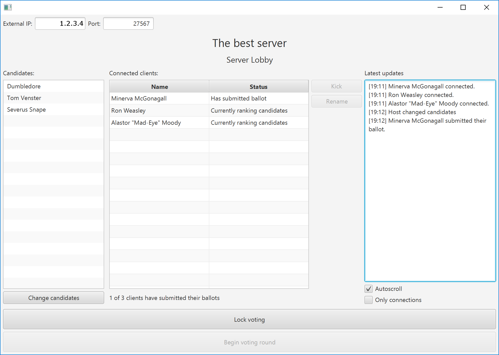

# instant-runoff-voting

Instant-runoff voting application

A way for you to streamline those democratic elections.

## Download

Download the latest version from the releases page:

https://github.com/Artorp/instant-runoff-voting/releases

## Prerequisites

The program requires at least Java 8 and JavaFX.

Linux users may have to install the openjfx libraries

    sudo apt-get install openjdk-8-jre openjfx

## Usage

Run the jar-file from a terminal with 

     java -jar the_jar_file.jar

or just start it directly.

